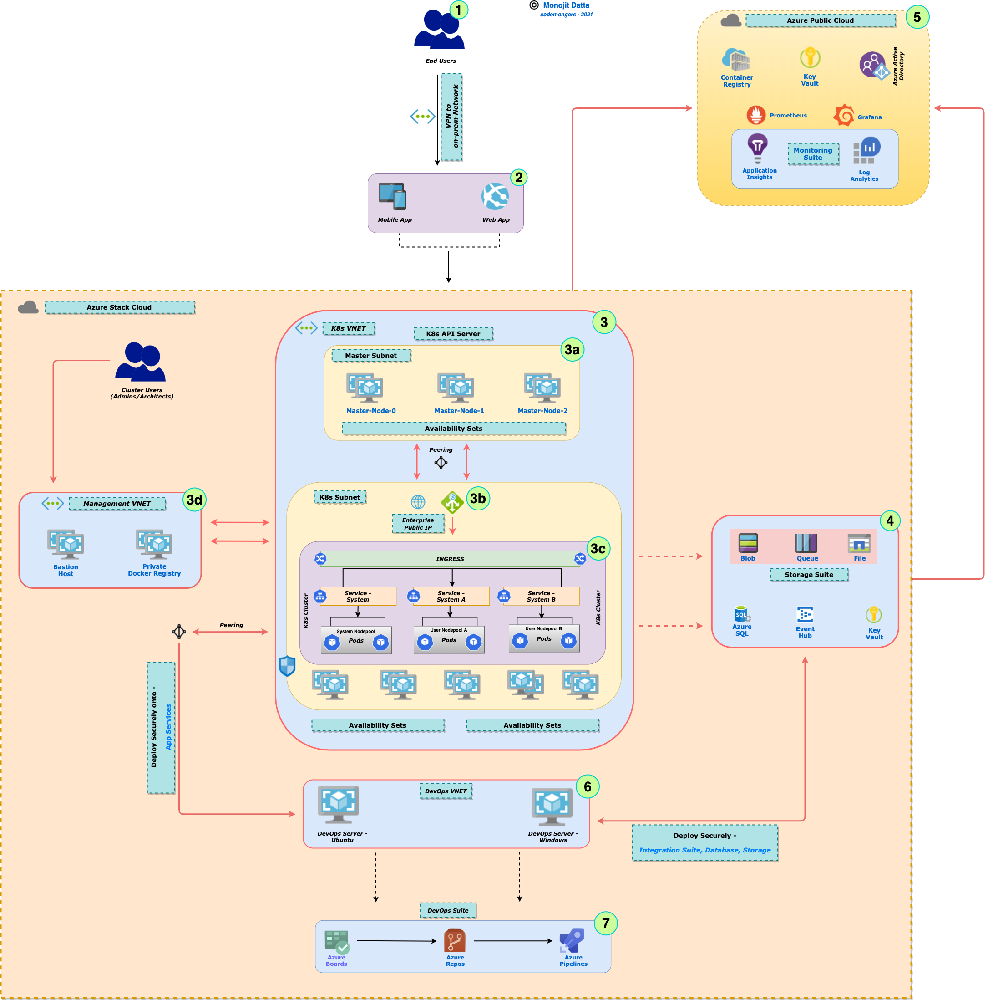
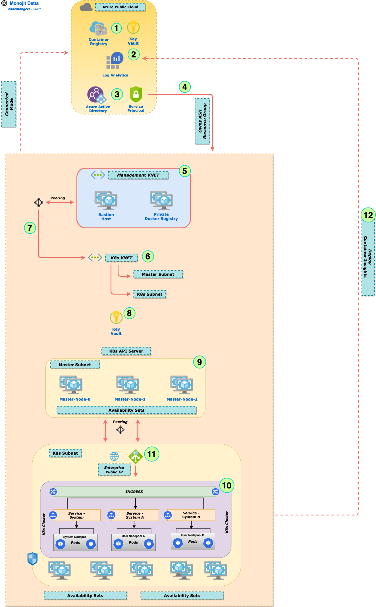
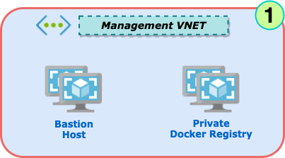
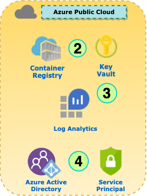
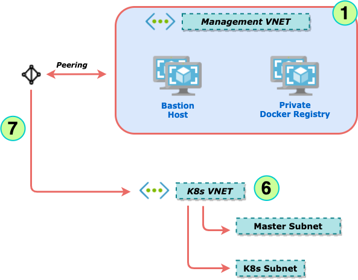
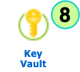
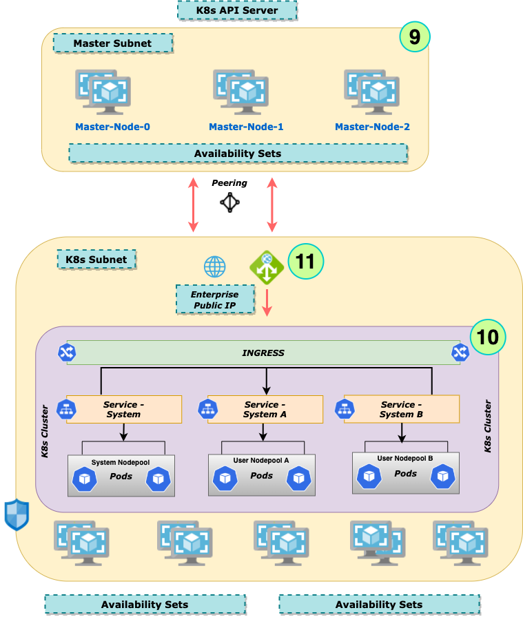

# Kubernetes Engine on Azure Stack Hub -

# Dive Deeper


## Prelude

This is in continuation to the workshop [Start-up Kubernetes Engine on Azure Stack Hub - Step-By-Step](./README.md) with the intent of diving deeper into the steps and scripts used to build the K8s cluster on *Azure Stack Hub*

The purpose of this workshop would be to:

- Use Kubernetes as the tool for orchestration of micro-services
- Build micro-services of varying nature and tech-stack
- Build an automated pipeline and workflow for creating Infrastructure for the deploying micro-services - *3-Step Approach*
- Use AKS-engine templates for creating the Core K8s infrastructure
- Use ARM templates to deploy other ancillary Azure resources
- Extend the pipeline to automate deployment of micro-services
- Use the built-in features of K8s for monitoring, security and upgrades
- Define Resource Quota and appropriate Storage for micro-services
- Integrating with Azure AD and define RBAC for the cluster and its sub-components

### Pre-requisites, Assumptions

- Knowledge on Containers and MicroServices - *L300+*

- How to build docker image and create containers from it

- Knowledge on K8s  - *L300+*

- Gone through the workshop - [Start-up Kubernetes Engine on Azure Stack Hub - Step-By-Step](./README.md)

- Prepare the Jump Server VM as mentioned in the above article

- Some knowledge on Azure tools & services viz. *Azure CLI, KeyVault, VNET* etc. would help

- Apps and Micro-Services would be used interchangeably i.e. both are treated as same in this context

  

## Reference Architecture



## Action

Let us now get into some action with all *Plans* in-place!

As we had mentioned, it would be a 3-step approach to create the cluster. We would first do this with scripts from command line and then would do the same using Azure DevOps. Once the cluster is ready, we can start deploying applications onto it. Let us set the ball rolling...

Before getting into actual action, couple of minutes to understand the folder structure that we would be following (*most important*). 

### Deployments

- **Certs** - Contains all certificates needed; in this case basically the SSL certificate for Ingress controller

  (*Note*: *This folder is not checked into the repo; please create this folder on your local system and necessary certificates*)

- **Azure-CLI** - Contains all necessary files for azure cli scripts to be used for deployment. For folks want to do in Terraform way should create a similar folder and the appropriate files inside

  - **Setup** - Contains all the scripts to be used in this process

    (***Ref***: *Deployments/Azure-CLI/Setup*)

  - **Templates** - The key folder which contains all ARM templates and corresponding PowerShell scripts to deploy them. This ensures a completely decoupled approach for deployment; all ancillary components can be deployed outside the cluster process at any point of time!

    (***Ref***: ***Deployments/Azure-CLI/Templates***)

- **YAMLs** - Contains all YAML files needed post creation of cluster - Post Provisioning stage where created cluster is configured by Cluster Admins

  (***Ref***: ***Deployments/YAMLs***)

  - **ClusterAdmin** - Scripts for Cluster Admin functionalities

    (*Ref*: ***Deployments/YAMLs/ClusterAdmin***)

  - **Common** - Scripts used across different namespaces - e.g. *nginx ingress* configuration file

    (*Ref*: ***Deployments/YAMLs/Common***)

  - **Ingress** - Scripts for Ingress creation for the DEV namespace

    (*Ref*: ***Deployments/YAMLs/DEV/Ingress***)

  - **Monitoring** - Scripts for Container Monitoring for entire cluster. For this workshop it includes the Prometheus config map which would allow Prometheus to scrape data from specific Pods, Services

    (*Ref*: ***Deployments/YAMLs/DEV/Monitoring***)
    
  - **Netpol** - Scripts for defining network policies between Pods, Services as well as outbound from Pods
  
    (*Ref*: ***Deployments/YAMLs/DEV/Netpol***)
  
  - **RBAC** - Scripts for defining RBAC between various resources within K8s cluster
  
    (*Ref*: ***Deployments/YAMLs/DEV/RBAC***)


## Anatomy of the Approach




### Step-By-Step



1. **Clone** the repo — https://github.com/monojit18/ASHK8sWorkshop.git into your local folder somewhere on the VM. Open and browse the files in VS Code editor and have a quick look; check the folder structure as described in the section [above](#deployments)

2. #### PreConfig on Azure Cloud

   

   ***Deployments/Azure-CLI/Setup/azc-cluster-preconfig.ps1***

   - **Parameters**

     ```powershell
     param([Parameter(Mandatory=$false)] [string] $resourceGroup = "azc-workshop-rg",
           [Parameter(Mandatory=$false)] [string] $location = "eastus",
           [Parameter(Mandatory=$false)] [string] $clusterName = "ash-workshop-cluster",
           [Parameter(Mandatory=$false)] [string] $acrName = "azcashacr",
           [Parameter(Mandatory=$false)] [string] $keyVaultName = "azc-workshop-kv",
           [Parameter(Mandatory=$false)] [string] $logWorkspaceName = "azc-workshop-lw",
           [Parameter(Mandatory=$false)] [string] $acrTemplateFileName = "azc-acr-deploy",
           [Parameter(Mandatory=$false)] [string] $kvTemplateFileName = "azc-keyvault-deploy",
           [Parameter(Mandatory=$false)] [string] $lwTemplateFileName = "azc-lw-deploy",
           [Parameter(Mandatory=$false)] [string] $containerTemplateFileName = "containerSolution",
           [Parameter(Mandatory=$false)] [string] $subscriptionId = "<subscription_Id>",
           [Parameter(Mandatory=$false)] [string] $objectId = "<object_Id>",
           [Parameter(Mandatory=$false)] [string] $baseFolderPath = "<base_Folder_Path>")
     ```

   - **Local Variables**

     ```powershell
     $azcSPDisplayName = $clusterName + "-sp"
     $azcSPIdName = $clusterName + "-sp-id"
     $azcSPSecretName = $clusterName + "-sp-secret"
     $wsIdName = $clusterName + "-ws-id"
     $wsSecretName = $clusterName + "-ws-secret"
     $templatesFolderPath = $baseFolderPath + "/Azure-CLI/Templates"
     ```

   - **Azure CLI Commands to be Executed**

     ```powershell
     # Find existing Resource Group Id
     $rgShowCommand = "az group show --name $resourceGroup --subscription $subscriptionId --query 'id' -o json"
     
     # Create a new Resource Group
     $rgCreateCommand = "az group create --name $resourceGroup -l $location --subscription $subscriptionId --query='id'"
     ```

     ```powershell
     # Find existing ACR Id
     $acrShowCommand = "az acr show -n $acrName --query 'id' -o json"
     
     # Deploy a new ACR using ARM template
     $acrDeployCommand = "az deployment group create -g $resourceGroup --template-file $templatesFolderPath/ACR/$acrTemplateFileName.json --parameters acrName=$acrName"
     ```

     ```powershell
     # Find existing KeyVault Id
     $keyVaultShowCommand = "az keyvault show -n $keyVaultName --query 'id' -o json"
     
     # Deploy a new KeyVault using ARM template
     $keyVaultDeployCommand = "az deployment group create -g $resourceGroup --template-file $templatesFolderPath/KeyVault/$kvTemplateFileName.json --parameters keyVaultName=$keyVaultName objectId=$objectId"
     ```

     ```powershell
     # Find existing Log Analytics Workspace Id
     $logWorkspaceShowCommand = "az monitor log-analytics workspace show -g $resourceGroup -n $logWorkspaceName --query='id'"
     
     # Deploy a Log Analytics Workspace using ARM template
     $logWorkspaceDeployCommand = "az deployment group create -g $resourceGroup --template-file $templatesFolderPath/Monitoring/$lwTemplateFileName.json --parameters workspaceName=$logWorkspaceName location=$location resourcePermissions=true"
     ```

     ```powershell
     # Find existing Service Principal
     $spShowCommand = "az ad sp show --id http://$azcSPDisplayName --query 'appId'"
     
     # Create a new Service Principal
     $spCreateCommand = "az ad sp create-for-rbac --skip-assignment --name $azcSPDisplayName --query '{appId:appId, secret:password}' -o json"
     ```

   - **Select Subscription to use**

     ```powershell
     $subscriptionCommand = "az account set -s $subscriptionId"
     Invoke-Expression -Command $subscriptionCommand
     ```

   - **Check and Create Resource Group**

     ```powershell
     $rgRef = Invoke-Expression -Command $rgShowCommand
     if (!$rgRef)
     {
        $rgRef = Invoke-Expression -Command $rgCreateCommand
        if (!$rgRef)
        {
             Write-Host "Error creating Resource Group"
             return;
        }
     
        Write-Host $rgRef
     
     }
     ```

   - **Check and Create ACR**

     ```powershell
     $acrInfo = Invoke-Expression -Command $acrShowCommand
     if (!$acrInfo)
     {
         
         Invoke-Expression -Command $acrDeployCommand
         $acrInfo = Invoke-Expression -Command $acrShowCommand
         Write-Host $acrInfo
     
     }
     ```

   - **Check and Create KeyVault**

     ```powershell
     $keyVaultInfo = Invoke-Expression -Command $keyVaultShowCommand
     if (!$keyVaultInfo)
     {
     
         Invoke-Expression -Command $keyVaultDeployCommand
         $keyVaultInfo = Invoke-Expression -Command $keyVaultShowCommand
         Write-Host $keyVaultInfo
     
     }
     ```

   - **Check and Create Log Analytics Workspace**

     ```powershell
     $logWorkspaceInfo = Invoke-Expression -Command $logWorkspaceShowCommand
     if (!$logWorkspaceInfo)
     {
     
         Invoke-Expression -Command $logWorkspaceDeployCommand
         $logWorkspaceInfo = Invoke-Expression -Command $logWorkspaceShowCommand
         Write-Host $logWorkspaceInfo
     
     }
     
     # Deploys Container Insights Solution inside teh Log Analytics Workspace
     $containerSolutionDeployCommand = "az deployment group create -g $resourceGroup --template-file $templatesFolderPath/Monitoring/$containerTemplateFileName.json --parameters workspaceResourceId=$logWorkspaceInfo workspaceRegion=$location"
     Invoke-Expression -Command $containerSolutionDeployCommand
     ```

   - **Check and Create Service Principal**

     ```powershell
     $azcSP = Invoke-Expression -Command $spCreateCommand
     if (!$azcSP)
     {
     
     Write-Host "Error creating Service Principal for AKS"
     return;
     
     }
     
     $appId = ($azcSP | ConvertFrom-Json).appId
     $secret = ($azcSP | ConvertFrom-Json).secret
     ```

   - **Check and Add Service Principal *Id* into the KeyVault** (*for later use*)

     ```powershell
     # Check 
     $kvShowAppIdCommand = "az keyvault secret show -n $azcSPIdName --vault-name $keyVaultName --query 'id' -o json"
     $kvAppIdInfo = Invoke-Expression -Command $kvShowAppIdCommand
     if (!$kvAppIdInfo)
     {
     
     	# Store
       $kvSetAppIdCommand = "az keyvault secret set --vault-name $keyVaultName --name $azcSPIdName --value $appId"
       Invoke-Expression -Command $kvSetAppIdCommand
     }
     ```

   - **Check and Add Service Principal *Secret* into the KeyVault** (*for later use*)

     ```powershell
     # Check
     $kvShowSecretCommand = "az keyvault secret show -n $azcSPSecretName --vault-name $keyVaultName --query 'id' -o json"
     $kvSecretInfo = Invoke-Expression -Command $kvShowSecretCommand
     if (!$kvSecretInfo)
     {
     	# Store
       $kvSetSecretCommand = "az keyvault secret set --vault-name $keyVaultName --name $azcSPSecretName --value $secret"
       Invoke-Expression -Command $kvSetSecretCommand
     }
     ```

   - **Assign appropriate Roles to the Service Principal**

     ```powershell
     # AcrPush Role to the Service Principal
     $acrRoleCommand = "az role assignment create --assignee $appId --role 'AcrPush' --scope $acrInfo"
     Invoke-Expression -Command $acrRoleCommand
     
     # Owner Role to the Service Principal
     $resourceGroupRoleCommand = "az role assignment create --assignee $appId --role 'Owner' --scope '/subscriptions/$subscriptionId/resourceGroups/$resourceGroup'"
     Invoke-Expression -Command $resourceGroupRoleCommand
     ```

   - **Retrieve and Store Log Analytics Workspace *Id*** (*for later use*)

     ```powershell
     # Retrieve
     $workspaceIdCommand = "az monitor log-analytics workspace list --resource-group $resourceGroup --query '[0].customerId' -o json"
     $workspaceId = Invoke-Expression -Command $workspaceIdCommand
     
     # Check
     $kvShowWsIdCommand = "az keyvault secret show -n $wsIdName --vault-name $keyVaultName --query 'id' -o json"
     $kvWsIdInfo = Invoke-Expression -Command $kvShowWsIdCommand
     if (!$kvWsIdInfo)
     {
     		# Store
         $kvSetWorkspaceIdCommand = "az keyvault secret set --vault-name $keyVaultName --name $wsIdName --value $workspaceId"
         Invoke-Expression -Command $kvSetWorkspaceIdCommand
     }
     ```

   - **Retrieve and Store Log Analytics Workspace *Secret*** (*for later use*)

     ```powershell
     # Retrieve
     $workspaceSecretCommand = "az monitor log-analytics workspace get-shared-keys --resource-group $resourceGroup --workspace-name $logWorkspaceName --query 'primarySharedKey' -o json"
     $workspaceSecret = Invoke-Expression -Command $workspaceSecretCommand
     
     # Check
     $kvShowWsSecretCommand = "az keyvault secret show -n $wsSecretName --vault-name $keyVaultName --query 'id' -o json"
     $kvWsSecretInfo = Invoke-Expression -Command $kvShowWsSecretCommand
     if (!$kvWsSecretInfo)
     {
     		# Store
         $kvSetWorkspaceSecretCommand = "az keyvault secret set --vault-name $keyVaultName --name $wsSecretName --value $workspaceSecret"
         Invoke-Expression -Command $kvSetWorkspaceSecretCommand
     }
     ```

3. #### PreConfig on Azure Stack Cloud

   

   

   

   

   - Set cloud option to *Azure Stack User*

   - Update Cloud Profile for Hybrid Cloud

   - Login to Azure Tenant

   - ***Deployments/Azure-CLI/Setup/ash-cluster-preconfig.ps1**

     - **Parameters**

     ```powershell
     param([Parameter(Mandatory=$false)] [string] $resourceGroup = "ash-workshop-rg",
           [Parameter(Mandatory=$false)] [string] $bastionResourceGroup = "<bastion_Resource_Group>",
           [Parameter(Mandatory=$false)] [string] $location = "<stack_hub_location>",
           [Parameter(Mandatory=$false)] [string] $clusterName = "ash-workshop-cluster",
           [Parameter(Mandatory=$false)] [string] $keyVaultName = "ash-workshop-kv",
           [Parameter(Mandatory=$false)] [string] $bastionVNetName = "master-hub-vnet",
           [Parameter(Mandatory=$false)] [string] $ashVNetName = "ash-workshop-vnet",
           [Parameter(Mandatory=$false)] [string] $ashVNetPrefix = "12.0.0.0/16",
           [Parameter(Mandatory=$false)] [string] $ashSubnetName = "ash-workshop-subnet",
           [Parameter(Mandatory=$false)] [string] $ashSubnetPrefix = "12.0.0.0/21",
           [Parameter(Mandatory=$false)] [string] $kvTemplateFileName = "ash-keyvault-deploy",
           [Parameter(Mandatory=$false)] [string] $networkTemplateFileName = "ash-network-deploy",
           [Parameter(Mandatory=$false)] [string] $subscriptionId = "<subscription_Id>",
           [Parameter(Mandatory=$false)] [string] $objectId = "<object_Id>",
           [Parameter(Mandatory=$false)] [string] $baseFolderPath = "<base_Folder_Path>")
     ```

   - **Local Variables**

     ```powershell
     $aksSPDisplayName = $clusterName + "-sp"
     $templatesFolderPath = $baseFolderPath + "/Azure-CLI/Templates"
     ```

   - **Azure CLI Commands to be Executed**

     ```powershell
     # Find existing Resource Group Id
     $rgShowCommand = "az group show --name $resourceGroup --subscription $subscriptionId --query 'id' -o json"
     
     # Create a new Resource Group
     $rgCreateCommand = "az group create --name $resourceGroup -l $location --subscription $subscriptionId --query='id'"
     
     # Find existing VNet/Subnet details
     $networkShowCommand = "az network vnet show -n $ashVNetName -g $resourceGroup --query 'id' -o json"
     $networkNames = "ashVNetName=$ashVNetName ashVNetPrefix=$ashVNetPrefix ashSubnetName=$ashSubnetName ashSubnetPrefix=$ashSubnetPrefix"
     
     # Deploy VNet/Subnet
     $networkDeployCommand = "az deployment group create -g $resourceGroup --template-file $templatesFolderPath/Network/$networkTemplateFileName.json --parameters $networkNames"
     
     # Find existing KeyVault
     $keyVaultShowCommand = "az keyvault show -n $keyVaultName --query 'id' -o json"
     
     # Deploy KeyVault
     $keyVaultDeployCommand = "az deployment group create -g $resourceGroup --template-file $templatesFolderPath/KeyVault/$kvTemplateFileName.json --parameters keyVaultName=$keyVaultName objectId=$objectId"
     
     # Find existing Service Principal
     $spShowCommand = "az ad sp show --id http://$aksSPDisplayName --query 'appId'"
     ```

   - **Select Subscription to use**

     ```powershell
     $subscriptionCommand = "az account set -s $subscriptionId"
     Invoke-Expression -Command $subscriptionCommand
     ```

   - **Check and Create Resource Group**

     ```powershell
     $rgRef = Invoke-Expression -Command $rgShowCommand
     if (!$rgRef)
     {
     	$rgRef = Invoke-Expression -Command $rgCreateCommand
       if (!$rgRef)
       {
         Write-Host "Error creating Resource Group"
         return;
       }
     
     	Write-Host $rgRef
     
     }
     ```

   - **Deploy VNet/Subnet for K8s Cluster; Peer with Jump Server VNet**

     ```powershell
     $ashVnet = Invoke-Expression -Command $networkShowCommand
     if (!$ashVnet)
     {
     
     		# Deploy VNet/Subnet for K8s
         Invoke-Expression -Command $networkDeployCommand
         $ashVnet = Invoke-Expression -Command $networkShowCommand
         Write-Host $ashVnet
     
     		# Find VNet/Subnet for Jump Server
         $bstnVnetShowCommand = "az network vnet show -n $bastionVNetName -g $bastionResourceGroup --query 'id' -o json"
         $bstnVnet = Invoke-Expression -Command $bstnVnetShowCommand
         
         # Peer VNets of Jump Server with that of K8s Cluster
         $vnetPeeringCommand = "az network vnet peering create -g $resourceGroup -n ash-master-peering --vnet-name $ashVNetName --remote-vnet '$bstnVnet' --allow-forwarded-traffic --allow-vnet-access"
         Invoke-Expression -Command $vnetPeeringCommand
     
         $vnetPeeringCommand = "az network vnet peering create -g $bastionResourceGroup -n master-ash-peering --vnet-name $bastionVNetName --remote-vnet '$ashVnet' --allow-forwarded-traffic --allow-vnet-access"
         Invoke-Expression -Command $vnetPeeringCommand
     
     }
     ```

   - **Check and Create KeyVault**

     

     ```powershell
     $keyVaultInfo = Invoke-Expression -Command $keyVaultShowCommand
     if (!$keyVaultInfo)
     {
     
         Invoke-Expression -Command $keyVaultDeployCommand
         $keyVaultInfo = Invoke-Expression -Command $keyVaultShowCommand
         Write-Host $keyVaultInfo
     
     }
     ```

   - **Assign appropriate Roles to the Service Principal**

     ```powershell
     # Find Service Pronciapl created on Azure Public Cloud
     $azcSP = Invoke-Expression -Command $spShowCommand
     if (!$azcSP)
     {
     
         Write-Host "Error retrieving Service Principal"
         return;
     
     }
     
     # Assign Owner Role to the Service Pronciapl
     $resourceGroupRoleCommand = "az role assignment create --assignee $azcSP --role 'Owner' --scope '/subscriptions/$subscriptionId/resourceGroups/$resourceGroup'"
     Invoke-Expression -Command $resourceGroupRoleCommand
     ```

     

4. **Setup K8s Cluster on *Azure Stack Cloud***

   

   - **Parameters**

     ```powershell
     param([Parameter(Mandatory=$false)] [string] $resourceGroup = "ash-workshop-rg",
           [Parameter(Mandatory=$false)] [string] $location = "<stack_hub_location>",
           [Parameter(Mandatory=$false)] [string] $clusterName = "ash-workshop-cluster",
           [Parameter(Mandatory=$false)] [string] $keyVaultName = "ash-workshop-kv",
           [Parameter(Mandatory=$false)] [string] $ashVNetName = "ash-workshop-vnet",
           [Parameter(Mandatory=$false)] [string] $ashSubnetName = "ash-workshop-subnet",
           [Parameter(Mandatory=$false)] [string] $clientAppID = "<client_App_ID>",
           [Parameter(Mandatory=$false)] [string] $serverAppID = "<server_App_ID>",
           [Parameter(Mandatory=$false)] [string] $adminGroupID = "<admin_Group_ID>",
           [Parameter(Mandatory=$false)] [string] $tenantID = "<tenant_ID>",
           [Parameter(Mandatory=$false)] [string] $subscriptionId = "<subscription_Id>",
           [Parameter(Mandatory=$false)] [string] $baseFolderPath = "<base_Folder_Path>") # Till Deployments
     ```

   - **Local Variables**

     ```powershell
     $ashSPIdName = $clusterName + "-sp-id"
     $ashSPSecretName = $clusterName + "-sp-secret"
     $templatesFolderPath = $baseFolderPath + "/Azure-CLI/Templates"
     $outputFolderPath = $templatesFolderPath + "/AKSEngine/Output/ClusterInfo"
     ```

   - **Select Subscription to use**

     ```powershell
     $subscriptionCommand = "az account set -s $subscriptionId"
     Invoke-Expression -Command $subscriptionCommand
     ```

   - **Retrieve the Service Principal *Id* from the KeyVault**

     ```powershell
     
     $kvShowAppIdCommand = "az keyvault secret show -n $ashSPIdName --vault-name $keyVaultName --query 'value' -o tsv"
     $spAppId = Invoke-Expression -Command $kvShowAppIdCommand
     if (!$spAppId)
     {
           Write-Host "Error fetching Service Principal Id"
           return;
     }
     ```

   - **Retrieve the Service Principal *Id* from the KeyVault**

     ```powershell
     $kvShowSecretCommand = "az keyvault secret show -n $ashSPSecretName --vault-name $keyVaultName --query 'value' -o tsv"
     $spPassword = Invoke-Expression -Command $kvShowSecretCommand
     if (!$spPassword)
     {
           Write-Host "Error fetching Service Principal Password"
           return;
     }
     ```

   - **Retrieve the *Subnet Id* of the K8s cluster VNet**

     ```powershell
     $networkShowCommand = "az network vnet subnet show -n $ashSubnetName --vnet-name $ashVNetName -g $resourceGroup --query 'id' -o tsv"
     $ashVnetSubnetId = Invoke-Expression -Command $networkShowCommand
     if (!$ashVnetSubnetId)
     {
     
           Write-Host "Error fetching Vnet"
           return;
     
     }
     ```

   - **Deploy K8s cluster**

     - Browse to ***Deployments/Azure-CLI/Templates/AKSEngine/ash-config.json***

     - This is the Config file used by AKS-engine to deploy new K8s cluster

     - Default values are all set; rest will be supplied at runtime by the following script - **ash-cluster-setup.ps1**

       ```powershell
       $genericSetCommand = "--set masterProfile.dnsPrefix=$clusterName"
       $aadSetCommand = ",aadProfile.clientAppID=$clientAppID,aadProfile.serverAppID=$serverAppID,aadProfile.adminGroupID=$adminGroupID,aadProfile.tenantID=$tenantID"
       
       $vnetSubnetSetCommand = ",masterProfile.vnetSubnetId='$ashVnetSubnetId',agentPoolProfiles[0].vnetSubnetId='$ashVnetSubnetId',agentPoolProfiles[1].vnetSubnetId='$ashVnetSubnetId',agentPoolProfiles[2].vnetSubnetId='$ashVnetSubnetId'"
       
       $parametersSetCommand = $genericSetCommand + $aadSetCommand + $vnetSubnetSetCommand
       
       $deployCommand = "aks-engine-554 deploy -m '$templatesFolderPath/AKSEngine/ash-config.json' --azure-env 'AzureStackCloud' -g $resourceGroup -l $location --client-id '$spAppId' --client-secret '$spPassword' $parametersSetCommand -o '$outputFolderPath' -f --auto-suffix"
       Invoke-Expression -Command $deployCommand
       ```

5. #### PostConfig for K8 Cluster

   

   - The K8s cluster is still with Cluster Admin group members

   - ***Deployments/Azure-CLI/Setup/ash-cluster-postconfig.ps1***

     - **Parameters**

       ```powershell
       param([Parameter(Mandatory=$false)] [string] $resourceGroup = "ash-workshop-rg",
             [Parameter(Mandatory=$false)] [string] $projectName = "ash-workshop",
             [Parameter(Mandatory=$false)] [string] $clusterName = "ash-workshop-cluster",
             [Parameter(Mandatory=$false)] [string] $clusterInternalName = "<cluster_internal_name>",
             [Parameter(Mandatory=$false)] [string] $keyVaultName = "ash-workshop-kv",
             [Parameter(Mandatory=$false)] [string] $baseFolderPath = "<base_Folder_Path>")
       ```

     - **Local Variables**

       ```powershell
       $wsIdName = $clusterName + "-ws-id"
       $wsSecretName = $clusterName + "-ws-secret"
       $yamlFilePath = "$baseFolderPath/YAMLs"
       $ingControllerName = $projectName + "-ing"
       $ingControllerNSName = $ingControllerName + "-ns"
       $ingControllerFileName = "internal-ingress"
       $monitoringNSName = "monitoring"
       ```

     - **Retrieve the Service Principal *Id* from the KeyVault**

       ```powershell
       $kvShowWSIdCommand = "az keyvault secret show -n $wsIdName --vault-name $keyVaultName --query 'value' -o tsv"
       $wsId = Invoke-Expression -Command $kvShowWSIdCommand
       if (!$wsId)
       {
             Write-Host "Error fetching Monitoring Id"
             return;
       }
       ```

     - **Retrieve the Service Principal *Id* from the KeyVault**

       ```powershell
       $kvShowWSSecretCommand = "az keyvault secret show -n $wsSecretName --vault-name $keyVaultName --query 'value' -o tsv"
       $wsSecret = Invoke-Expression -Command $kvShowWSSecretCommand
       if (!$wsSecret)
       {
             Write-Host "Error fetching Monitoring Secret"
             return;
       }
       ```

     - **Azure CLI Commands** 

       - **Create Monitoring Namespace**

         ```powershell
         $monitoringNSCommand = "kubectl create namespace $monitoringNSName"
         Invoke-Expression -Command $monitoringNSCommand
         ```

       - **Install Container Insights Solution to Log Analytics Workspace** (*on Azure Public Cloud*)

         - **Add and Update Repo for the ContainerInsights Helm chart**

           ```powershell
           $repoAddCommand = "helm repo add microsoft https://microsoft.github.io/charts/repo"
           Invoke-Expression -Command $repoAddCommand
           
           $repoUpdateCommand = "helm repo update"
           Invoke-Expression -Command $repoUpdateCommand
           ```

         - **Install**

           ```powershell
           $installCommand = "helm install azmoncon -n monitoring --set omsagent.secret.wsid=$wsId,omsagent.secret.key=$wsSecret,omsagent.env.clusterName=$clusterInternalName, microsoft/azuremonitor-containers"
           Invoke-Expression -Command $installCommand
           ```

       - **Create Nginx Ingress Namespace**

         ```powershell
         $nginxNSCommand = "kubectl create namespace $ingControllerNSName"
         Invoke-Expression -Command $nginxNSCommand
         ```

       - **Add and Update Repo for the Nginx Ingress Helm chart**

         ```powershell
         $repoAddCommand = "helm repo add ingress-nginx https://kubernetes.github.io/ingress-nginx"
         Invoke-Expression -Command $repoAddCommand
         
         $repoUpdateCommand = "helm repo update"
         Invoke-Expression -Command $repoUpdateCommand
         ```

       - **Nginx Internal Load Balancer**

         ```powershell
         $nginxILBCommand = "helm install $ingControllerName ingress-nginx/ingress-nginx --namespace $ingControllerNSName -f $yamlFilePath/Common/$ingControllerFileName.yaml"
         Invoke-Expression -Command $nginxILBCommand
         ```

### References

- **Azure Container Registry** - https://docs.microsoft.com/en-us/azure/container-registry/
- **Docker Private Registry** - https://docs.docker.com/registry/deploying/
- **Azure Stack Hub** - 
  - https://docs.microsoft.com/en-us/azure-stack/user/?view=azs-2008
  - https://docs.microsoft.com/en-us/azure-stack/operator/?view=azs-2008
- **AKS-Engine Docs** - https://github.com/Azure/aks-engine/tree/master/docs
- **AKS-Engine on Stack Hub** - https://github.com/Azure/aks-engine/blob/master/docs/topics/azure-stack.md